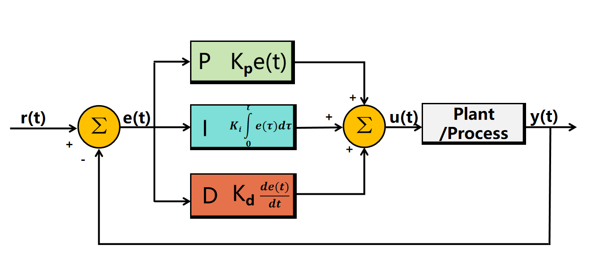
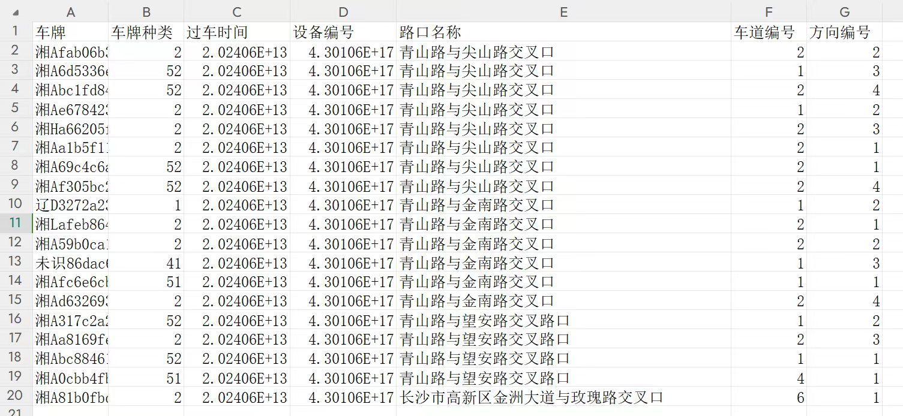

#                             traffic_twin

### 1.航点控制

第一部分是在Town10仿真场景实现交通数字孪生，首先根据脚本获取车辆运行航点，包括在Carla中的x，y以及时间戳。然后使用相应的控制算法对车辆进行控制，使得车辆按预先生成的轨迹行驶到达目的地。

#### 轨迹平滑

这里用到的轨迹平滑算法的核心思想是通过在原始路径点之间插入额外的点来平滑车辆的轨迹。当相邻路径点之间的距离大于设定的最小距离阈值时，计算它们之间的插值点，并将这些点添加到平滑后的路径中。这种插值方法生成的路径点更密集和连续，使得车辆的轨迹更加平滑和自然，适合用于需要精确路径跟踪的场景。

#### 控制

**PID控制**：由三个主要部分组成：比例控制（P）、积分控制（I）和微分控制（D）。每个部分都有特定的作用，能够对系统的不同方面进行调节。

**输入**：轨迹数据（包括期望的车辆轨迹、当前车辆状态）、环境信息（如道路状况、障碍物信息）以及系统的控制策略。

**输出**：具体的控制命令，如加速、减速、转向指令等，发送给车辆的执行器（如发动机、刹车系统、方向盘等）。



#### 使用

**1.使用Town10场景，然后创建Python 3.8的虚拟环境。**

```
pip install -r requirements.txt
pip install matplotlib==2.2.2
```

**2. 导航至 CARLA 可执行程序目录，比如：**

```
> cd C:/CARLA
```

**3. 打开CARLA仿真器**

```
CarlaUE4.exe 
```

**4. 运行脚本，选择合适的控制器**

```
> python Drive.py --Longitudinal-Controller: {PID, ALC} --Lateral-Controller: {BangBang, PID, PurePursuit, Stanley, POP}
```

这里推荐使用默认的PID控制器，不添加参数运行脚本！.

### 2.路口导航

#### 全局路径规划

我们使用中电软件园的仿真场景来做车辆的数字孪生。轨迹信息并不是一个个相距很近的航点，而是车辆经过每个路口时的信息，其包括车牌、车牌种类、过车时间、设备编号、路口名称、车道编号以及方向编号。我们测试的数据选自2024年6~8月中的6月3日7:00点~7:20的车辆数据，其如下图所示：



另外，我们再建立一个通用数据库，将路口、车道、方向映射到CARLA仿真场景中道路终点坐标位置，包括x, y, z和yaw。这样，我们便可以控制车辆从一个路口导航到另一个路口。

#### 规划原理

##### 拓扑地图提取

拓扑地图提取是从CARLA环境中提取道路网络结构的过程，旨在为后续的路径规划提供基础。首先，通过与CARLA的地图服务器连接，获取整个地图的道路信息。这个过程包括识别每条道路的起点和终点，并记录它们之间的重要路径节点。这些信息随后被整理成一个有向图，节点代表道路的入口和出口，而边则表示它们之间的连接关系。最终，这些数据被结构化存储，以便后续的导航和决策使用。

##### 搜索Graph 建立

在拓扑地图构建完成后，下一步是进行图的搜索与路径规划。这个过程旨在找到从起点到终点的最佳行驶路线。

构建的图是一个有向图，其中节点代表道路网络中的特定位置（例如交叉口、路径的起点和终点），而边则代表连接这些位置的道路段。每条边不仅记录了连接的两个节点，还包含了道路的相关属性，如长度、方向、是否为交叉口等。

##### 寻找最优路径

最终，经过路径搜索算法的计算，将返回一系列按顺序排列的节点。这些节点代表车辆应遵循的行驶路径，包括必要的转向和变道信息。返回的路径不仅考虑了行驶的顺畅性，还会在可能的情况下优化行驶时间，确保安全性和效率。

#### 车辆控制

即使我们使用的是CARLA自带的全局路径规划模块，其底层还是使用的控制算法来控制车辆按指定航点行驶。规划路径的同时，在航点之间已经生成了一系列的驾驶决策。当然，还可以自己控制车辆的行为，如刹车、油门等。当一辆车从一个路口行驶到另一个路口后，设置车辆的下一个路口的目标位置，这样我们就完成了基于CARLA的智能交叉口导航与数字孪生系统。


