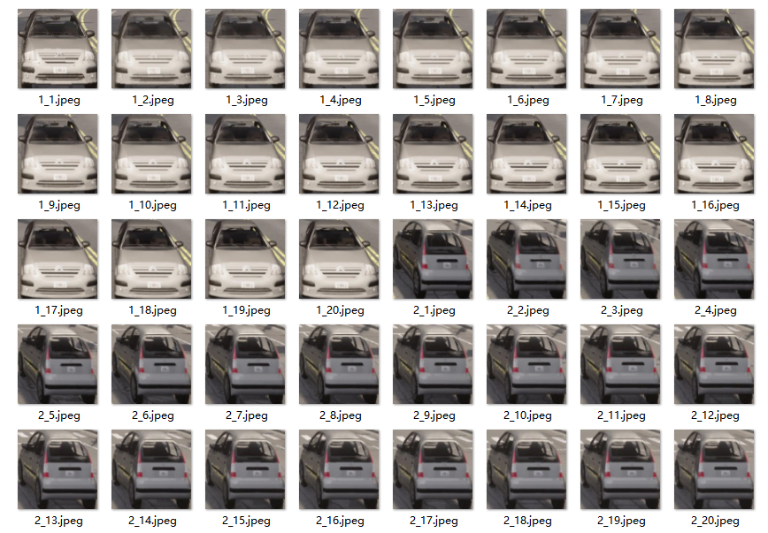
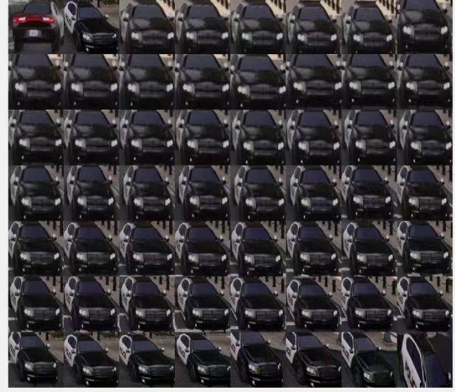
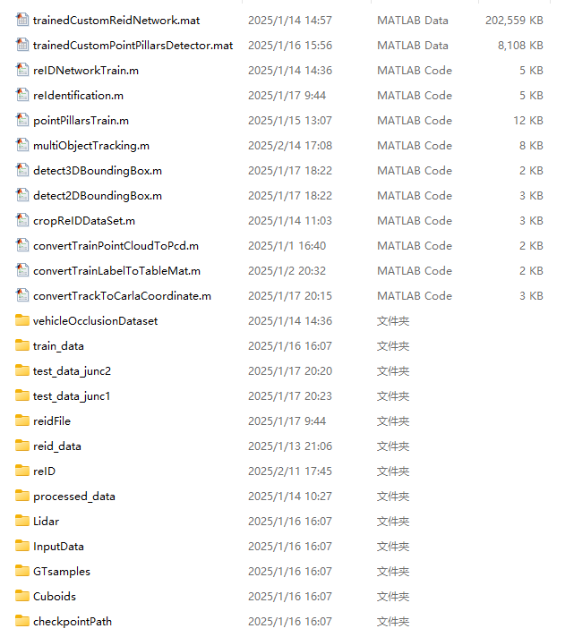

#                         基于雷达和相机的多目标跟踪 

### **项目简介**

​       本项目通过结合相机与雷达传感器，利用CARLA仿真平台进行多目标跟踪，获取车辆在多个路口的精确轨迹，并通过再识别技术整合整体轨迹，实现对车辆的精准控制，从而构建完整的车辆数字孪生系统。

### 安装与配置

##### 安装CARLA仿真平台

**1.安装CARLA0.9.15**[Releases · carla-simulator/carla](https://github.com/carla-simulator/carla/releases)

**2.配置MATLAB，选择版本2024b，下载安装:**

- [Deep Learning Toolbox](https://ww2.mathworks.cn/help/deeplearning/index.html)


- [Computer Vision Toolbox Model for YOLO v4 Object Detection](https://ww2.mathworks.cn/help/vision/ug/getting-started-with-yolo-v4.html)
- [Deep Learning Toolbox Model for ResNet-50 Network ](https://ww2.mathworks.cn/matlabcentral/fileexchange/64626-deep-learning-toolbox-model-for-resnet-50-network)
- [Sensor Fusion and Tracking Toolbox](https://ww2.mathworks.cn/help/fusion/index.html)
- [Automated Driving Toolbox](https://ww2.mathworks.cn/help/driving/index.html)

**3.[克隆项目](https://github.com/OpenHUTB/traffic_twin)**，**安装虚拟环境，下载项目依赖**

```
pip install -r requirements.txt
```

### 实验步骤

#### **使用 PointPillars 深度学习进行激光雷达 3D 目标检测**

我们使用CARLA中的激光雷达和摄像头来作数据融合进行车辆跟踪，获取车辆相对于自车的轨迹。因此，需要使用CARLA中的雷达数据集来训练pointPillars网络。[参考示例。](https://ww2.mathworks.cn/help/lidar/ug/object-detection-using-pointpillars-network.html#mw_rtc_Lidar3DObjectDetectionUsingPointPillarsExample_M_5DF0B7C9)

**1.收集点云数据集**

在Twon10场景中 ，运行[collect_lidar_dataset.py](./multi_obj_track/collect_lidar_dataset.py)脚本收集点云训练集，包括点云数据和3D标签框，放在./multi_obj_track下。

**2.点云数据预处理**

在MATLAB中，运行[convertTrainPointCloudToPcd.m](./multi_obj_track/convertTrainPointCloudToPcd.m)将点云训练集转换成PCD文件，以及[convertTrainLabelToTableMat.m](./multi_obj_track/convertTrainLabelToTableMat.m)将全部帧的训练标签合成一个mat文件。

**3.训练**

运行[pointPillarsTrain.m](./multi_obj_track/pointPillarsTrain.m)，开始训练！将训练好的模型保存在当前目录下。

#### 激光雷达和摄像头数据的对象级融合

**1.收集轨迹跟踪的数据**

在Town10场景，运行[collect_intersection_camera_lidar.py](./multi_obj_track/collect_intersection_camera_lidar.py)收集多目标跟踪的测试数据，其中每个路口中心包括1个激光雷达，雷达周围哦覆盖6个RGB相机，收集每一帧的6个视角的场景图片和点云数据，放在./multi_obj_track下。

**2.数据预处理**

- 运行[detect3DBoundingBox.m](./multi_obj_track/detect3DBoundingBox.m)检测点云中的车辆，获取3D标签，


- 运行[detect2DBoundingBox.m](./multi_obj_track/detect2DBoundingBox.m)检测图片中的车辆，获取2D标签（这里我们直接使用的是预训练的yolov4模型）。

**3.数据融合，获取轨迹**

执行[multiObjectTracking.m](./multi_obj_track/multiObjectTracking.m)可视化跟踪的车辆，输出trackedData.mat。

**4.坐标转换**

获取的轨迹是相对于自车的坐标，然而我们假设自车是静止在路口中间（实际不存在），雷达和相机都附着在自车上，也就是说与自车存在一个相对位置，[**示例**]([激光雷达和摄像头数据的对象级融合，用于车辆跟踪](https://ww2.mathworks.cn/help/fusion/ug/object-level-fusion-of-lidar-and-camera-data-for-vehicle-tracking.html))中雷达与车辆的相对位置是[0,0,0]，但本项目中雷达是高出一定的距离。[convertTrackToCarlaCoordinate.m](./multi_obj_track/convertTrackToCarlaCoordinate.m)将坐标转换成CARLA场景中的轨迹，使用的是相对于自车的，因此(x,y)是正确的。

**注意！**

上述步骤获取内容仅是一个路口的数据，[collect_intersection_camera_lidar.py](./multi_obj_track/collect_intersection_camera_lidar.py)收集测试数据的时候，根据需求在脚本中选择雷达的位置！！！相机是相对于雷达的，无需修改。

#### 使用 ReID 网络在路口间再识别车辆

**1.收集车辆再识别数据集**

我们使用[collect_reid_dataset.py](./multi_obj_track/collect_reid_dataset.py)在相同的位置生成车辆，在车辆起点和终点位置分别放一个RGB相机和一个语义分割相机，获取每一帧的车辆头部和尾部方向的图片以及2D标签。

**2.数据裁剪**

运行[cropReIDDataSet.m](./multi_obj_track/cropReIDDataSet.m)将前后视角的车辆图片根据2D标签进行裁剪，并且将同一类型车辆两个视角的图片整合到一起，最后reshape为224x224的大小。



**3.训练**

[reIDNetworkTrain.m](./multi_obj_track/reIDNetworkTrain.m)改用 imagePretrainedNetwork 函数并指定 resnet50 模型进行训练，该神经网络已基于大量图像学习了丰富的特征表示。

**4.测试**

将路口1位置跟踪到的车辆车辆图片和路口2位置该视角相机的图片放在一起进行再识别[reIDNetworkTrain.m](./multi_obj_track/reIDNetworkTrain.m)， 也就是说第一张图是要重新识别的对象，在下个路口进行识别，进而整合二者的轨迹。



#### 项目文件目录

如下图所示，是项目的完整目录，但只包含了一个路口的多目标跟踪数据。


